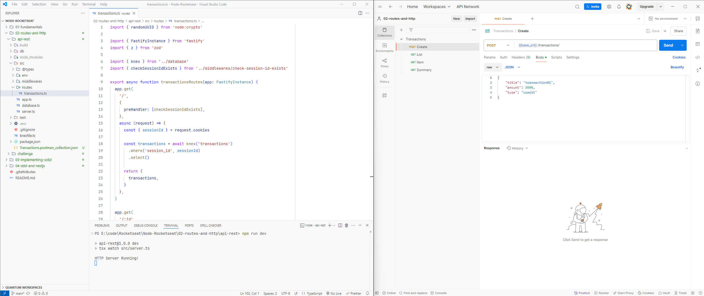

# Routes and HTTP - Financial Transaction API



## Description

This is a financial transactions API built as part of the Node.js course at Rocketseat. The API allows users to manage their financial transactions, including credit and debits. It uses cookies for authentication and to display user-specific records.

## Technologies Used

-  **Fastify** - High-performance web framework for Node.js
-  **Knex.js** - SQL query builder for database interactions
-  **Vitest** - Testing framework for unit testing

## Installation

1. Install dependencies:

   ```sh
   npm install
   ```

2. Configure the database:

   -  Create a `.env` file and set up the database connection.
   -  Run migrations:
      ```sh
      npm run knex -- migrate:latest
      ```

3. Start the application:
   ```sh
   npm run dev
   ```

## API Endpoints

### Create a Transaction

-  **Method:** POST
-  **URL:** `/transactions/`
-  **Request Body:**
   ```json
   {
      "title": "transaction01",
      "amount": 3000,
      "type": "credit"
   }
   ```

### List All Transactions

-  **Method:** GET
-  **URL:** `/transactions`

### Get a Specific Transaction

-  **Method:** GET
-  **URL:** `/transactions/{transaction_id}`

### Get Transaction Summary

-  **Method:** GET
-  **URL:** `/transactions/summary`

Sample: Import the `Transactions.postman_colletion.json` file into Postman

## Testing

To run the tests, execute:

```sh
npm test
```
