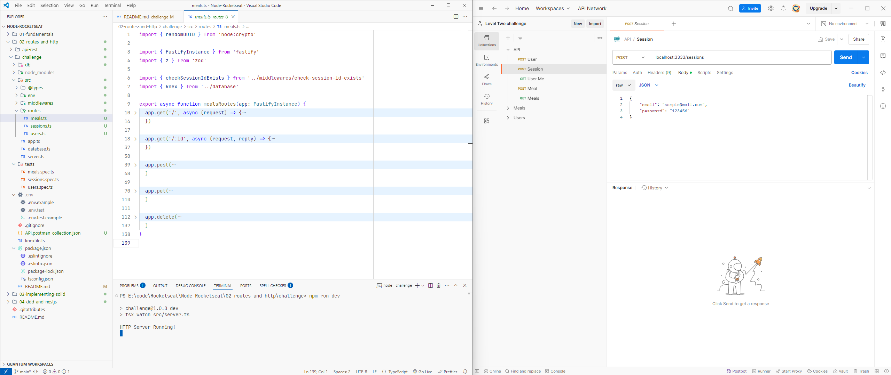

# Meal Tracker API Challenge



This project is a challenge from the Rocketseat Node.js course. It is a RESTful API built with **Fastify** for the HTTP server, **Knex.js** for database migrations and queries, and **Vitest** for testing. The API allows users to register, authenticate, and manage their meals with features to create, update, delete, and view meals, as well as retrieve user-specific meal metrics.

## Authentication

This API uses cookie-based authentication. When a user logs in via the `/sessions` endpoint, a session cookie is set in the client's browser. This cookie must be included in subsequent requests to access protected endpoints (such as `/users/me` and `/meals`). Ensure that your client or API testing tool is configured to handle cookies correctly.

---

## API Endpoints

### User Routes

-  **POST `/users`**  
   Create a new user.

   **Request Body Example:**

   ```json
   {
      "name": "sample",
      "email": "sample@mail.com",
      "password": "123456"
   }
   ```

-  **POST `/sessions`**  
    Authenticate a user using login credentials. On successful authentication, a session cookie is set.

   **Request Body Example:**

   ```json
   {
      "email": "sample@mail.com",
      "password": "123456"
   }
   ```

-  **GET `/users/me`**  
   Retrieve the authenticated user's profile. This endpoint requires the session cookie for authentication.

### Meal Routes

-  **POST `/meals`**  
    Create a new meal associated with a user.

   **Request Body Example:**

   ```json
   {
      "name": "meal01",
      "description": "description01",
      "date_time": "2024-10-11T20:00:00Z",
      "within_diet": true
   }
   ```

-  **GET `/meals`**  
    List all meals for the authenticated user.

**You can also import the `API.postman_colletion.json` Postman collection to quickly test the API endpoints:**

## Project Setup

### Installation

1. **Install dependencies:**

   ```sh
   npm install
   ```

2. **Environment Configuration:** Create a `.env` file in the root directory and add the necessary environment variables. For example:

   ```sh
   NODE_ENV=development
   DATABASE_URL="./db/app.db"
   DATABASE_CLIENT=sqlite
   PORT=3333
   ```

3. **Configure the database:**

   -  Create a `.env` file and set up the database connection.
   -  Run migrations:
      ```sh
      npm run knex -- migrate:latest
      ```

4. **Start the application:**

   ```sh
   npm run dev
   ```

## Challenge Requirements

-  [x] **User Management:**
   -  It should be possible to create a user.
   -  It should be possible to identify the user between requests.
-  [x] **Meal Management:**
   -  It should be possible to register a meal with the following information:
      -  Meals should be related to a user.
      -  Name.
      -  Description.
      -  Date and Time.
      -  Whether it is within the diet or not.
   -  It should be possible to edit a meal, allowing all the above data to be changed.
   -  It should be possible to delete a meal.
   -  It should be possible to list all meals of a user.
   -  It should be possible to view a single meal.
-  [x] **Metrics:**
   -  It should be possible to retrieve user metrics:
      -  Total number of meals registered.
      -  Total number of meals within the diet.
      -  Total number of meals outside the diet.
      -  Best sequence of meals within the diet.
-  [x] **Security:**
   -  The user can only view, edit, and delete meals they have created.

---
